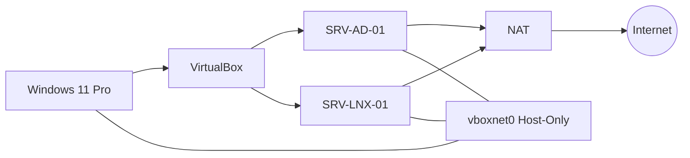

# Network topology (NAT + Host-Only)

```mermaid
flowchart LR
  Host[Windows 11 Pro] --> VB[VirtualBox]
  VB --> AD[SRV-AD-01]
  VB --> LNX[SRV-LNX-01]
  AD --> NAT[NAT] --> Internet((Internet))
  LNX --> NAT
  Host --- HO[vboxnet0 Host-Only]
  AD --- HO
  LNX --- HO
```
- vboxnet0: 192.168.56.0/24 (Host: 192.168.56.1, DHCP OFF)
- SRV-AD-01: 192.168.56.10 (AD DS + DNS)
- SRV-LNX-01: 192.168.56.20 (Debian + Docker)

